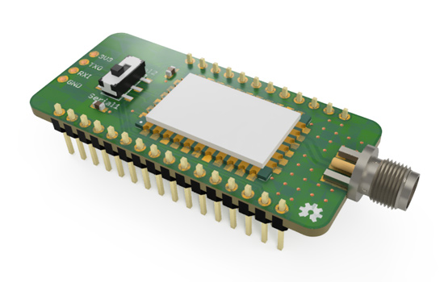

# RAK811 FeatherWing for the Feather M0  

This shield gives LoRaWAN connectivity to Adafruit's Feather M0 via the RAK811 module. Examples directory demonstrate usage/configuration with The Things Network.

Advantages of using the RAK811:
* Compared to other full-stack devices, the RAK811 is small in size and fits nicely on FeatherWing dimensions.
* Using an LMIC library to run a full LoRaWAN stack on the M0 can be challenging when interrupts and delays are needed.
* By removing the LoRaWAN stack from the M0, more flash memory is available.

The M0 has 6 possible serial communication (SERCOM) interfaces. The shield has a DPDT switch to select which SERCOM is used for RAK811 communication:
* `Serial1` uses the default UART RX/TX pins at D0 and D1. 
* `Serial2` uses pins D10 and D11 for RX/TX (Examples assume Serial2 is used)

## Updating the RAK811 Module
The board has a UART breakout for updating the RAK811's firmware and bootloader as newer versions are released.
To update the bootloader with the STM32CubeProgrammer, add solder to the jumper on the bottom of PCB. Remove solder to update firmware.

